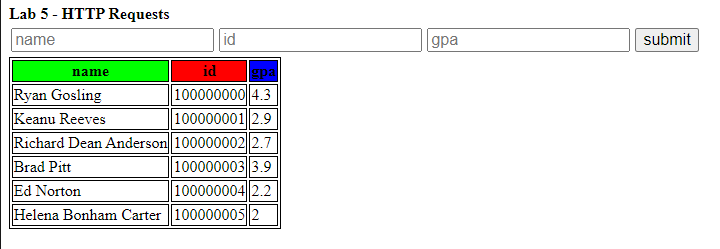

# Client (Lab 4 - Basic HTML Website)

This is the solution for the website portion of this lab.

## Modifications

Students will need to copy over the following files from their lab 4:

- `index.html`
- `css/styles.css`
- `js/main.js`

>The student needs to remove the default `<tr>` in their `index.html` file because this is duplicate
>data.

The main modifications will be in their `main.js` file, they will need to:

- use an anonymous JS function which executes onload which:
  - fetches the data from the Glassfish server
  - transforms the data into `<tr>`s
  - outputs the `<tr>`s to the `table#chart > tbody` element

It should look as follows:

## Autograding

There is autograding for the javascript portion of the lab, you can find the tests in `cypress/e2e/*.cy.js`.

The following files test for:

- `main.cy.js`
  - HTML
    - asserts that the IDs (`input#name`, `input#gpa`, etc.) should exist
    - asserts that the `<input>` tags should have placeholder text
    - asserts that the table headers have the correct text and ordering
  - CSS
    - the classes (`red`, `green`, etc) should have their respective color
    - `div.row` should be a flexbox
  - JS
    - asserts that the page renders data correctly and in the correct order
    - asserts that each field, if empty, the page should do nothing
- `api.cy.js`
  - asserts that the page should render the data from the payload in the table
