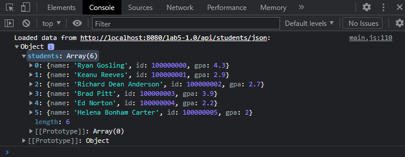

# Lab 5 - HTTP Requests

>Course: CSCI 2020U: Software Systems Development and Integration

[](https://git-scm.com)

## Overview

This is meant to get you acquainted with HTTP requests and how to communicate with an API via a website.

>Here's what the website should look like:

[](./sample_website_output.png)

>Here's what an **example output** of the console should look like:

[](./sample_console_output.png)

## Lab Work

This lab is a combination of labs 3 & 4, the end goal being communication between your API from lab 3 and website from lab 4.

You will need to copy over the main files from labs 3 & 4 (e.g., java, javascript, CSS & HTML files) from the previous labs to
this lab.

```
lab 5
- api/ (lab 3)
	- .mvn/
	- src/
	- pom.xml
	...
- client/ (lab 4)
	- css/
	- cypress/
	- js/
	- index.html
	...
```

The page's existing functionality should still remain but whenever the page loads,
it should make an HTTP request to your API to populate the table.

Specific modifications are found in their respective directories `api` and `client`.

>See the `readme.md` files in both subdirectories on how to properly modify your lab.
